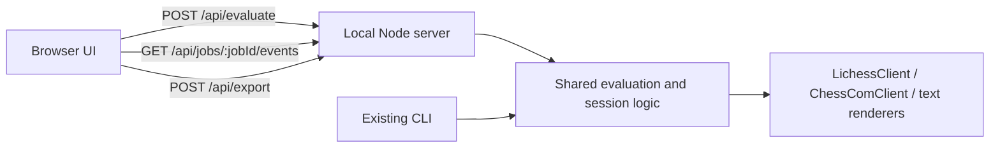

# Browser UI Migration

## Current State

- The repo is still CLI-first: `[src/cli.ts](C:/Users/keivf/Documents/20260227_chess_opening_eval/src/cli.ts)` owns prompts, history navigation, progress bars, CSV export, and evaluation orchestration.
- The text renderers that must remain the source of truth already exist in `[src/board.ts](C:/Users/keivf/Documents/20260227_chess_opening_eval/src/board.ts)` and `[src/evaluator.ts](C:/Users/keivf/Documents/20260227_chess_opening_eval/src/evaluator.ts)`.
- The browser UI basis and behavioral requirements are defined in `[design/20260314_html_page.html](C:/Users/keivf/Documents/20260227_chess_opening_eval/design/20260314_html_page.html)` and `[design/20260314_ui_specs.md](C:/Users/keivf/Documents/20260227_chess_opening_eval/design/20260314_ui_specs.md)`.

## Target Architecture

## Implementation Plan

1. Extract reusable workflow/state logic out of `[src/cli.ts](C:/Users/keivf/Documents/20260227_chess_opening_eval/src/cli.ts)` into shared modules so both CLI and browser code can reuse:

- initial position parsing
- history resolution / move-back behavior
- time-filter parsing
- evaluation orchestration
- CSV generation metadata

1. Keep the text output semantics unchanged by continuing to render board/table/CSV through `[src/board.ts](C:/Users/keivf/Documents/20260227_chess_opening_eval/src/board.ts)` and `[src/evaluator.ts](C:/Users/keivf/Documents/20260227_chess_opening_eval/src/evaluator.ts)`, then surface those strings in the browser with fixed-width `<pre>` blocks instead of rebuilding them as HTML widgets.
2. Add a local server entrypoint and job system, likely centered around a new `[src/server.ts](C:/Users/keivf/Documents/20260227_chess_opening_eval/src/server.ts)` plus shared request/event types near `[src/types.ts](C:/Users/keivf/Documents/20260227_chess_opening_eval/src/types.ts)`:

- serve the HTML/CSS/browser JS
- `POST /api/evaluate` to create a job from full submitted state
- `GET /api/jobs/:jobId/events` for SSE log/progress/result events
- `POST /api/export` for CSV download or export-to-disk

1. Reuse the existing client callback hooks in `[src/api/lichess.ts](C:/Users/keivf/Documents/20260227_chess_opening_eval/src/api/lichess.ts)` and `[src/api/chesscom.ts](C:/Users/keivf/Documents/20260227_chess_opening_eval/src/api/chesscom.ts)` to emit structured browser events for logs and progress, replacing terminal-only progress bar rendering in the browser path.
2. Adapt `[design/20260314_html_page.html](C:/Users/keivf/Documents/20260227_chess_opening_eval/design/20260314_html_page.html)` into the real frontend while preserving its layout vocabulary:

- central assistant/output column for logs, status, board, FEN, and table blocks
- user message bubble for submitted input
- composer form for position / move submission and actions
- explicit controls for move-back, force refresh, and CSV export
- structured progress rows and autoscrolling logs during active jobs

1. Update project wiring in `[package.json](C:/Users/keivf/Documents/20260227_chess_opening_eval/package.json)` and `[tsconfig.json](C:/Users/keivf/Documents/20260227_chess_opening_eval/tsconfig.json)` so the repo can run the local web server and include any new browser/server source layout cleanly.
2. Extend tests around the extracted shared logic and output-preservation paths, especially for history resolution, request-state handling, and keeping `renderBoard()` / `renderStatsTable()` output unchanged.

## Key Risks To Handle

- This is a UI-layer replacement, not a pure HTML restyle, because the repo has no existing browser/server layer.
- `[src/cli.ts](C:/Users/keivf/Documents/20260227_chess_opening_eval/src/cli.ts)` currently mixes state, I/O, and orchestration, so the refactor order matters.
- Several backend paths depend on `process.cwd()`, so the server entrypoint must preserve project-root execution assumptions for `data_in`, `data_out`, and Rust helpers.
- Browser progress must be structured state updates, not terminal redraw text.

